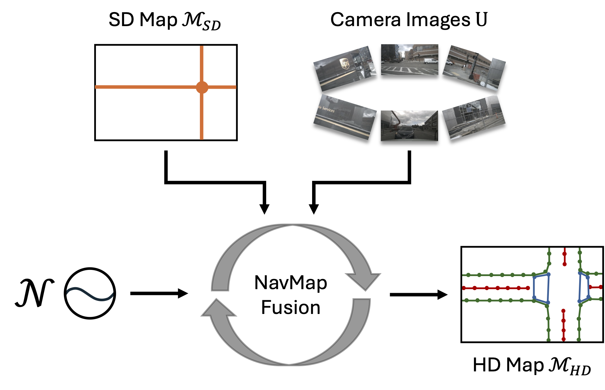

<div align="center">
  <h1>NavMapFusion</h1>
  
  <h3>[Accepted to WACV 2026] NavMapFusion: Diffusion-based Fusion of Navigation Maps for Online Vectorized HD Map Construction </h3>
  
  [](https://arxiv.org/abs/2512.03317)
  
  
</div>

## Introduction
This repository is the official implementation of NavMapFusion.
The code will be released soon. Stay tuned!

## Getting Started
### 1. Environment
**Step 1.** Create conda environment and activate it.

```
conda create --name navmapfusion python=3.8 -y
conda activate navmapfusion
```

**Step 2.** Install PyTorch.

```
pip install torch==1.9.0+cu111 torchvision==0.10.0+cu111 torchaudio==0.9.0 -f https://download.pytorch.org/whl/torch_stable.html
```

**Step 3.** Install MMCV series.

```
# Install mmcv-series
pip install mmcv-full==1.6.0
pip install mmdet==2.28.2
pip install mmsegmentation==0.30.0
git clone https://github.com/open-mmlab/mmdetection3d.git
cd mmdetection3d
git checkout v1.0.0rc6 
pip install -e .
```

**Step 4.** Install other requirements.

```
pip install -r requirements.txt
```

### 2. Data Preparation
**Step 1.** Download [NuScenes](https://www.nuscenes.org/download) dataset to `./datasets/nuScenes`.

**Step 2.** Generate annotation files for NuScenes dataset.

```
python tools/nuscenes_converter.py --data-root ./datasets/nuScenes --newsplit
```

**Step 3.** Prepare Navigation Map (OSM) Data.

We follow [P-MapNet](https://github.com/jike5/P-MapNet) to prepare the OpenStreetMap data.

Please download the pre-processed data and place it in `./datasets/osm`.

### 3. Training and Validating
To train a model with 8 GPUs:

```
bash tools/dist_train.sh ${CONFIG} 8
```

To validate a model with 8 GPUs, an $\eta$ parameter of 0.5, 5 DDIM sampling steps, and a query threshold of 0.5:

```
bash tools/dist_test.sh ${CONFIG} ${CEHCKPOINT} 8 --eta=0.5 --sampling_timesteps=5 --query_threshold=0.5 --eval
```


## Results

### Results on NuScenes newsplit
| Model | $\mathrm{AP}_{ped}$ | $\mathrm{AP}_{div}$| $\mathrm{AP}_{bound}$ | $\mathrm{AP}$ | Config | Epoch |
| :---: |   :---:  |  :---:  | :---:      |:---:|:---: |:---:   |
| StreamMapNet | 24.8 | 18.4 | 25.6 | 22.9 | [Config](./plugin/configs/streammapnet.py) | 24|
| StreamMapNet-MCA | 28.4 | 22.2 | 27.8 | 26.1 | [Config](./plugin/configs/streammapnet_mca.py) | 24|
| MapDiffusion | 23.4 | 21.6 | 22.2 | 22.4 | [Config](./plugin/configs/mapdiffusion.py)| 24 |
| NavMapFusion | 32.1 | 20.7 | 28.9 | 27.2 | [Config](./plugin/configs/navmapfusion.py)| 24 |


## Citation
If you find our paper or codebase useful in your research, please give us a star and cite our paper.
```
@article{monninger2025navmapfusion,
  title   = {NavMapFusion: Diffusion-based Fusion of Navigation Maps for Online Vectorized HD Map Construction},
  author  = {Monninger, Thomas and Zhang, Zihan and Staab, Steffen and Ding, Sihao},
  journal = {arXiv preprint arXiv:2512.03317},
  year    = {2025},
}
```

## Acknowledgments
We sincerely thank the open-sourcing of these works where our code is based on:
[StreamMapNet](https://github.com/yuantianyuan01/StreamMapNet),
[P-MapNet](https://github.com/jike5/P-MapNet).